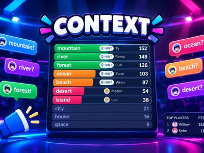
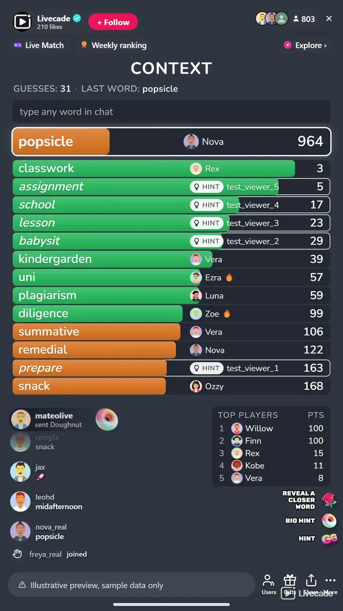

# Context - Interactive TikTok Live Game

> Guess the secret word by meaning.

A word game played by meaning. Your chat types any word, every guess gets a rank for how close it is to the secret word, and the board fills with the closest guesses until a viewer hits number 1. No timer: rounds end when the word is found.

**[Play Context on Livecade](https://livecade.io/games/context/?utm_source=github&utm_medium=readme&utm_campaign=context)** - runs as a single browser source in OBS, Streamlabs, or TikTok LIVE Studio. Nothing for viewers to install.

## How viewers play

Viewers take part with the actions TikTok already gives them: **comments**, **gifts**. Every action below is rebindable, so you decide which interaction drives which effect.

| Action | What it does |
| --- | --- |
| **Reveal a Closer Word** | Shows a word about three times closer than the best guess, credited to the viewer |
| **Big Hint** | Shows a word about eight times closer than the best guess |
| **Hint** | Shows a word a step closer than the best guess |

## How it works

### Every word gets a rank

Viewers type single words in chat. Each one is ranked by how close its meaning is to the secret word, and number 1 is the answer.

### Watch it get warmer

The closest guesses stay on the board with green, orange and red bars, and each viewer sees their own guess pinned at the top with its rank.

### Hints keep it moving

When nobody gets closer for a while, the game reveals a word about twice as close as the best guess. Hints stop a few steps short, so the last guess is always chat's.

### Find it, win it

The first viewer to type the secret word scores the most and takes the podium with the two viewers who got closest. Getting closer than anyone before also scores.

## About the game

Context hides one secret word and lets your whole chat hunt for it by meaning. Every word a viewer types gets a rank: number 1 is the secret, number 2 its closest neighbour, number 8,000 is nowhere near. The board keeps the closest guesses on screen with colored bars, green when chat is close, orange when it is getting warmer and red when it is far, so the room can see the trail closing in.

### Built for a live chat

Each viewer sees their own guess pinned at the top with its rank, even when it lands far down the list, and sentences and chatter are ignored so only single words count. A new word opens with a few far-off starter words on the board, so new viewers see how ranks work before anyone types. When chat gets stuck the game reveals a closer word on its own, and gifts can reveal closer words and bigger hints, though never the answer itself.

### Your words, your rules

Nearly 35,000 secret words across nine languages, from about 3,000 in Turkish to almost 5,000 in German, and the bank is yours to edit: hide the words you do not want, or add your own, which play first. Every word comes up once before any repeats, across your streams. Set the hints, the scoring, the colors and a title of your own, and turn on a How to play card from the dock whenever new viewers arrive.

## What it looks like on stream

[Watch Context gameplay](https://cdn.livecade.io/games/context.mp4)

## What you can configure

- **Language** - Nine languages for the words, the on-screen text and the board
- **Your word bank** - Hide secret words or add your own, which play first, in any language
- **Starter words** - Open each word with three far-off example words on the board
- **Automatic hints** - On or off, and how long chat can go without getting closer before one appears
- **Hint limits** - How many gift hints a word can take, and how close a hint may go
- **Color bands** - Where green ends and orange begins, and where orange gives way to red
- **Scoring** - Points for finding the word, and for getting closer than anyone before
- **Guesses per viewer** - Optionally cap how many words each viewer can guess per round
- **Match** - Play all stream, or end after a number of words or at a target score, with a podium for the top three
- **Leaderboard** - Keep the top players on screen, from 3 to 10
- **Read the winner** - Your stream voice reads the word and who found it
- **Your sounds** - Swap the sounds for a new guess, a new closest guess, a hint and the found word
- **Title and appearance** - Your own title or none, and colors for the bars, the board, the accent and the text
- **Background** - Transparent, a solid color, or your own image
- **Who can play** - Everyone, followers only, or your fans club only. Applies to comments and gifts

## Languages

English, Spanish, Portuguese, French, German, Italian, Romanian, Russian, Turkish

## FAQ

<strong>How do viewers play Context?</strong>

They type any single word in your TikTok Live chat. Each word gets a rank for how close its meaning is to the secret word, and the closest guesses fill the board. The first viewer to type the secret word wins the round.

<strong>Is it like Contexto?</strong>

It plays the same way as the popular daily word game, rebuilt for a live chat: the whole room guesses together, every viewer sees where their word landed, and there are hints, scores and a leaderboard. Context is our own game and not affiliated with it.

<strong>Do viewers need to send gifts to play?</strong>

No. Guessing is free and comment-driven, and automatic hints keep a stuck round moving. Gifts can reveal closer words and bigger hints, but never the answer.

<strong>Which languages does it support?</strong>

Nine: English, Spanish, Portuguese, French, German, Italian, Romanian, Russian and Turkish. Guesses typed without accents still count.

<strong>Can I choose the secret words?</strong>

Yes. The bank holds nearly 35,000 secret words across nine languages, and you can hide any of them or add your own, which play first. Every word comes up once before any repeats, across your streams.

<strong>Where do the rankings come from?</strong>

From word vectors trained on a large crawl of the web: fastText by Grave et al., used under the CC BY-SA 3.0 license. Words that often appear in similar contexts rank close together, so opposites like hot and cold can rank near each other too.

<strong>How do I add Context to my TikTok Live?</strong>

Add one browser source URL to OBS or your streaming software and go live. There is no plugin to install and nothing for your viewers to download.

## Setup

1. [Create a Livecade account](https://app.livecade.io/register?utm_source=github&utm_medium=cta&utm_campaign=context)
2. Copy your overlay browser source URL
3. Paste it into OBS, Streamlabs, or TikTok LIVE Studio
4. Pick Context, set your triggers, and go live

Runs in the browser, so it works on Windows and macOS with nothing to download. [See all TikTok Live games](https://livecade.io/tiktok-live-games/?utm_source=github&utm_medium=readme&utm_campaign=context).

---

_This repository documents Context, a hosted interactive game by [Livecade](https://livecade.io/?utm_source=github&utm_medium=footer&utm_campaign=context). The game runs on Livecade's platform, so there is no source to install here._
